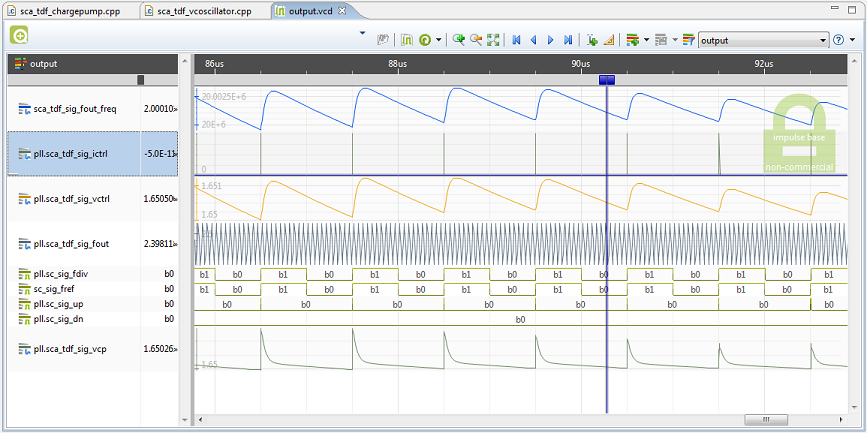

# Phase Locked Loop Simulator in SystemC-AMS
<div style="width: 100%; float:left; font-size:small">
  Keywords: <span style="color:#777">Phase Locked Loop</span>, <span
  style="color:#777">PLL</span>, <span
  style="color:#777">simulator</span>, <span
  style="color:#777">SystemC-AMS</span></div>
  <!-- <div style="width: 30%; float:right; font-size:small"></div> -->
  <div style="clear:both;">
</div>

## 1. Downloading and compiling

The code is available to download on
[github](https://github.com/americodias/sca_pll). To download using git just
run:

```bash
git clone https://github.com/americodias/sca_pll.git
```

This simulator can be compiled for macOS, Linux and Windows. However the
following requirements need to be satisfied:

* C++ compiler compatible with the
[C++14 standard](https://en.wikipedia.org/wiki/C%2B%2B14).
* SystemC Library 2.3.2 or greater
* SystemC-AMS Library 2.1 or greater

There are several tutorials available to compile SystemC libraries on the
following operating systems:

* [Linux](http://americodias.com/docs/systemc-ams/install/linux.md)
* [macOS](http://americodias.com/docs/systemc-ams/install/macos.md)
* [Windows (gcc)](http://americodias.com/docs/systemc-ams/install/windows.md)
* [Windows (Visual Studio)](http://americodias.com/docs/systemc-ams/install/windows_visual_studio.md)

### 1.1 Compiling with GCC on Windows, macOS and Linux

If you need to adjust the gcc version to be used (for instance on macOS) use
the following commands:

```bash
export CXX=g++-7
export LD=g++-7
```

If needed adjust the following lines in the Makefile to adapt to your case:

```bash
SYSTEMC_DIR=/usr/local/systemc-2.3.2
SYSTEMC_AMS_DIR=/usr/local/systemc-ams-2.1
```

and then write

```bash
make
```

If no errors occurs the binary is available in the *bin* folder.

### 1.2 Compiling with Visual Studio on Windows

Open the file *vstd\pll.sln* and then go to *Project > Properties > C/C++ >
General > Additional Include Directories* and correct the paths for SystemC
and SystemC-AMS.

Do the same for the library folder on *Project > Properties > Linker >
General > Additional Library Directories*.

Then *Build > Build solution* to compile.

## 2. How to use

Once the program is successfully compiled, calling it with the *--help* option
will return something like:

```
(SystemC AMS Copyright notice)

SystemC-AMS PLL simulator 1.0
Usage:
  pll.exe [OPTION...]

  -c, --config arg  Configuration file (default: options.json)
  -f, --format arg  Output file format (vcd or csv) (default: vcd)
  -h, --help        Print help (default: false)
```

### 2.1 System parameters

Most of the design parameters mentioned in section [2](#sec:building_blocks})
can be defined using a configuration file in json format. The program will look
for a configuration file called *option.json*, but other names might be used
when activating the *--config* option.

The available parameters are:

* System Level:
	* **vdd**: Supply voltage
	* **vcm**: Common mode voltage (dc offset for all ac signals)
	* **fref**: Reference clock frequency
	* **tstep**: Simulation time-step
	* **tsim**: Simulation time
* Charge Pump:
	* **current_up**: Charging current when the PMOS is saturated.
	* **current_dn**: Discharging current when the NMOS is saturated.
	* **current_leak**: Leaking current when both transistors are off.
	* **mosfet_vth**: Threshold voltage of the transistors.
* Loop Filter:
	* **order**: Filter orders
	* **c1**: C<sub>1</sub> value
	* **r2**: R<sub>2</sub> value
	* **c2**: C<sub>2</sub> value
	* **r3**: R<sub>3</sub> value (no effect for 2<sup>nd</sup> order filter)
	* **c3**: C<sub>3</sub> value (no effect for 2<sup>nd</sup> order filter)
* Voltage Controlled Oscillator
	* **kvo**: VCO gain (MHz/V),
	* **fmin**: Minimum frequency (when V<sub>ctrl</sub>=0)
* Frequency Divider:
	* **n**: Division factor

An example of this file is shown in section [3](#sec:example).

### 2.2 Data format and waveform viewers

In terms of output format there are two options available: VCD (default) or CSV.
These are the formats available on SystemC AMS. There are many VCD viewers
available on the web, some of them are free. [^fn5] One that I recommend is
called [Impulse](https://marketplace.eclipse.org/content/impulse), it is
multi-platform and is available as a plug-in for
[Eclipse](https://www.eclipse.org/) (or [Cevelop](https://www.cevelop.com/) in
my case).

[^fn5]: Waveform viewer. Accessed: 16-Feb-2018. [[Available
online]](https://goo.gl/gBb1D6 )

<div id="fig:impule_wave_viewer" style="text-align:center"
markdown="1">

<p style="font-size:small" markdown="1">**Figure 4.1:** Impulse wave viewer.</p>
</div>

Another good option for macOS is [Scansion](http://www.logicpoet.com/scansion/).

The CSV format is more suitable to use with gnuplot, Python (matplotlib,
or plotly), R (programming language) or even in Excel.

## 5. Example: A 2.4GHz PLL with 1MHz clock reference {#sec:example}

For the example I have chosen a 2.4-2.5GHz PLL with a reference of 1MHz. A
higher reference frequency would be better as can be seen later, but for
demonstration purposes its good enough. Also, this increases the computational
problem as the reference clock is at least 2400 times slower than the output.

I have simulated 4 different setups. Two with 45° phase margin (2<sup>nd</sup>
and 3<sup>rd</sup> order loop filter) and two with 60° phase margin. The
configuration file 2450MHz output frequency, 60° phase margin and 3<sup>rd</sup>
order loop filter looks like:

```
{
	"system": {
		"vdd": 3.3,
		"vcm": 1.65,
		"fref": 1e6,
		"tstep": 8e-12,
		"tsim": 2e-4
	}
	"charge_pump": {
		"current_up": 100e-6,
		"current_dn": 100e-6,
		"current_leak": 50e-9,
		"mosfet_vth": 0.7
	},
	"loop_filter": {
		"order": 3,
		"c1": 21e-12,
		"r2": 85.5e3,
		"c2": 364e-12,
		"r3": 10e3,
		"c3": 48e-12
	},
	"vco": {
		"kvo": 36.363636e6,
		"fmin": 2.39e9
	},
	"divider": {
		"n": 2450
	}
}
```

The values for the loop filter were calculated using the online calculator
mentioned in sub-section [2.2](#sub:charge_pump_loop_filter). [^fn3]

[^fn3]: D. K. Banerjee, "PLL performance, simulation, and design". Indianapolis,
IN.: Dog Ear Publishing, 2006.

<!--

Figures [5.2](#fig:pll_2450MHz_45deg_3rd_vs_2nd_order) and
[5.3](#fig:pll_2450MHz_60deg_3rd_vs_2nd_order) show the startup simulation
for the four configurations different used.

<div id="fig:pll_2450MHz_45deg_3rd_vs_2nd_order" style="text-align:center"
markdown="1">

<p style="font-size:small" markdown="1">**Figure 5.2:** PLL Startup, 45° phase
margin, 2<sup>nd</sup> order vs 3<sup>rd</sup> order loop filter <a
href='./pll_files/pll_2450MHz_45deg_3rd_vs_2nd_order.html'
target="_blank">(interactive version)</a>.</p>
</div>

<div id="fig:pll_2450MHz_60deg_3rd_vs_2nd_order" style="text-align:center"
markdown="1">

<p style="font-size:small" markdown="1">**Figure 5.3:** PLL Startup, 60° phase
margin, 2<sup>nd</sup> order vs 3<sup>rd</sup> order loop filter <a
href='./pll_files/pll_2450MHz_60deg_3rd_vs_2nd_order.html'
target="_blank">(interactive version)</a>.</p>
</div>

As expected, the configurations with 60° degree phase margin show a lower
overshoot and the undershoot is practically negligible.

The PSD for the 60° degree phase margin, 3<sup>rd</sup> order loop filter
configuration is shown in figure [5.4](#fig:pll_2450MHz_psd_60_3rd) and compared
with the 2<sup>nd</sup> order filter configuration in figure
[5.5](#fig:pll_2450MHz_psd_60_3rd_2nd).

<div id="fig:pll_2450MHz_psd_60_3rd" style="text-align:center"
markdown="1">

<p style="font-size:small" markdown="1">**Figure 5.4:** PLL PSD, 60° phase
margin, 3<sup>rd</sup> order loop filter <a
href='./pll_files/pll_2450MHz_psd_60_3rd.html' target="_blank">(interactive
version)</a>.</p>
</div>

<div id="fig:pll_2450MHz_psd_60_3rd_2nd" style="text-align:center"
markdown="1">

<p style="font-size:small" markdown="1">**Figure 5.5:** PLL PSD, 60° phase
margin, 2<sup>nd</sup> order vs 3<sup>rd</sup> order loop filter <a
href='./pll_files/pll_2450MHz_psd_60_3rd_2nd.html' target="_blank">(interactive
version)</a>.</p>
</div>

The several peaks outside the center frequency was expected and are caused by
the 1 MHz reference clock. So every 1MHz there is one peak and they are  called
reference-related spurs. But still, the first peaks to the right and left of the
center frequency have an attenuation of more than 20 dB, was specified in the
filter calculator (figure [5.1](#fig:filter_calculator)). If this attenuation is
not enough, the filter can be improved, or the reference frequency can be
increased.

As expected the 3<sup>rd</sup> order loop filter has a better performance
in terms of attenuation in the broadband area. But the difference is less only
around 4 dB.

The frequency obtained was 2.45022 MHz which represents and error of 9 PPM.
-->
